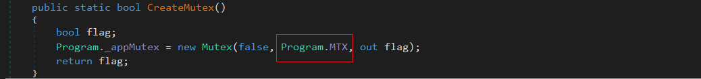
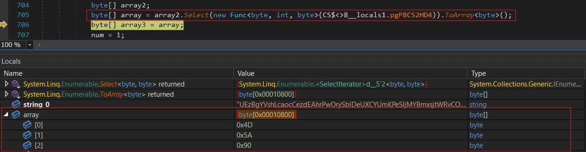
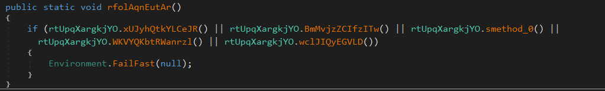
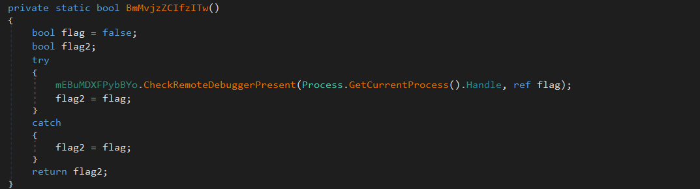
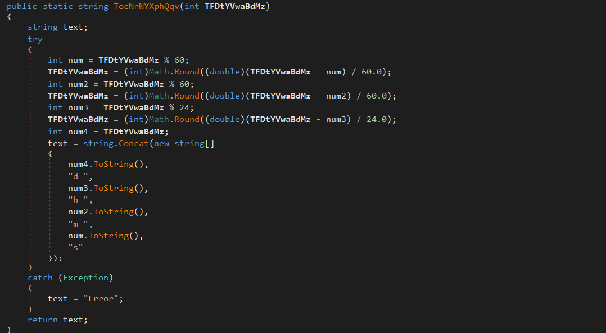
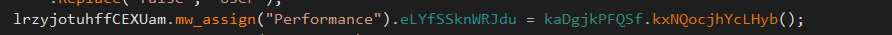
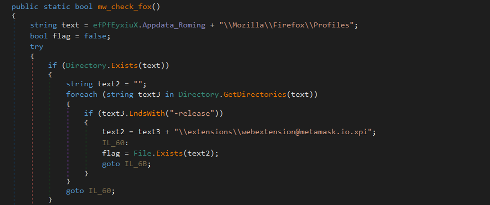

# OverView
Introduced in 2019 , **AsyncRAT** stands as a remote access trojan (RAT) , primarily functioning as a credential stealer and loader for various malware types , including ransomware . Its arsenal includes botnet capabilities and a command and control (C2) interface , enabling remote control of infected hosts by operators . Despite its official GitHub page bearing a legal disclaimer and promoting itself as a legitimate open-source remote administration tool , **AsyncRAT** finds almost exclusive use among cybercriminal threat actors .

Since its inception , **AsyncRAT** has experienced steady growth in usage and intermittent spikes in popularity , solidifying its status as a prominent threat . This malware is closely associated with other strains ; it originated from the **QuasaRAT** lineage and served as a foundation for **RevengeRAT** and **BoratRAT** .

**AsyncRAT** has been employed by a diverse array of threat actors , ranging from nation-state entities and prominent ransomware groups to burgeoning cybercrime factions in developing nations . These actors have conducted campaigns targeting a wide spectrum of victims worldwide , including aerospace , hospitality , IT , business services , transportation sectors , and governmental organizations across all regions .

# Stage 1 :
<br>

## Artifacts :


|No.	|Description	        |info  |
|-------|-----------------------|------| 
|1	    |MD5 Hash	            |5f7e0d25b165b9afcc3e6ca2bb135a47|
|2	    |SHA256 Hash            |b94bb64c9f1e39f900c095b2034d3302a2a1cfeca08096ac71ecd24b5a25c61d|
|3	    |File Size	            |10550 KB|
|4	    |VirusTotal Detection	|57/72|
<br>

## Analysis

In the ``cctor`` , there's a list called ``Program.List`` that holds strings with different parameters . These parameters are separated by the pipe character ``|`` . We'll find out about the separator ``Program.sp`` later on , and ``Program.MTX`` is used like a Mutex .


In the ``main`` , it waits for a bit, checks if another instance of the program is already running using ``mutex``, and then starts doing its main task , which is the ``WorkF`` method. It doesn't pass any specific arguments to this method , just ``null`` .


Inside the ``CreateMutex`` function , the malware sets a mutex using ``Program.MTX`` , as mentioned earlier .




Here , the malware is trying to separate a string from the ``code`` , which holds the value of ``Program.List`` . After separating it , the malware passes the result to a function called ``GETP`` . We need to investigate what exactly this ``GETP`` function does . so ``text`` will contain the process name .


The ``GETP`` method does two things . First, it checks if the input string contains ``%Current%`` . If it does, it replaces ``%Current%`` with the base directory of the malware . Second, it checks for any other environment variables in the input string and expands them .


After executing all of this , the variable named ``text`` holds the path for the parent malware with the new executable name . We'll need to investigate more about this . Additionally , the variable named ``text2`` contains only the path . The malware checks if this path exists , and if it doesn't , it creates it .


AsyncRAT checks the third value of ``code`` . If it's ``true`` , it fetches something from a resource and writes it into the variable ``text`` . However, since the third value in the ``code`` is ``false`` , the malware skips this process altogether .


This line of code writes bytes from a resource , obtained using the ``Program.GetTheResource`` function , to a file specified by the variable ``text`` , which contains the path for the executable. The specific resource to write is determined based on the first element of a split string obtained from ``Code`` , which is ``EUgNJfrbZv.exe`` , so we need to figure out what the function ``Program.GetTheResource`` actually does .


This method fetches a resource named ``dfzisgmpbvxt`` from the program itself . If necessary , it decompresses the resource and returns it as a series of bytes .


In the ``decompress`` function , it decompresses the input byte array using the ``GZip`` compression algorithm . First , it reads the length of the decompressed data from the first 4 bytes of the input stream . Then , it decompresses the data using a ``GZipStream`` . Finally , it returns the decompressed data as a byte array .


The ``decompress`` function returns an executable file .


This code snippet checks if the fourth element of the string obtained from ``Code`` is true . If it is, it tries to set the attributes of the file specified by ``text`` which contain the path of new executable to include both ``Hidden`` and ``System`` .


Here , the malware checks if the second element of the string obtained from ``Code`` is true . If it is , it tries to start a process associated with the file specified by the ``text`` variable .


After running the ``EUgNJfrbZv.exe`` process , the malware does the same actions again for another executable named ``SeedsChecker (1).exe`` , which is also found in the resource named ``dfzisgmpbvxt`` .


Then, I dumped it as well, and now let's figure out what these executables do .

<br>

# First executable ``EUgNJfrbZv.exe``
<br>

## Stage 1 :
<br>

### Artifacts :


|No.	|Description	        |info  |
|-------|-----------------------|------| 
|1	    |MD5 Hash	            |6ff8156ec6df07062b3a9f9594604a2b|
|2	    |SHA256 Hash            |1fddeef51fb61303fcd232c0d7bd9bb45cf9d7b6a4377d8ccb479ae562ae79be|
|3	    |File Size	            |216 KB|
|4	    |VirusTotal Detection	|40/71|
<br>

### Analysis

When loading the binary in ``dnspy`` , it's obfuscated. So , we'll attempt to deobfuscate it using a tool called ``de4dot`` .


After deobfuscating the executable , there are still some parts that are obfuscated , but let's proceed with our analysis now .


The first malware combines strings together in variable named``text`` , and functions like ``mFkZa6KHRQqICbnKpU.BvBFnA6v8()`` contain strings inside them as well .


Here , the variable ``text`` is passed to the function ``mFkZa6KHRQqICbnKpU.l4eTWjQIV`` , and the return value from it is stored in a variable named ``array`` .


After running this line , the variable ``array`` holds another executable. Before analyzing this new executable , let's continue our investigation because we're about to uncover something very interesting .



The function ``mFkZa6KHRQqICbnKpU.yiiARXwTw`` takes ``array``(which holds the new executable) as a parameter , so we need to find out what it actually does in this function .


In the entry , we encounter a function named ``mFkZa6KHRQqICbnKpU.pA9dbb0Zl`` to which no parameters are passed . Let's investigate further into it .


After renaming some functions within ``mFkZa6KHRQqICbnKpU.pA9dbb0Zl`` , we observe that the malware decodes some strings from Base64 encoding . Specifically, the variable named ``@string`` corresponds to ``AmsiScanBuffer`` and ``array`` corresponds to ``amsi.dll`` .


here try to load ``amsi.dll`` 


Now attempting to obtain the address for ``AmsiScanBuffer`` .


It's a guess , but the malware sets ``array3`` with values retrieved from the field ``struct0_0`` and then copies this value into ``array4`` .

```
Hint : the the comment (// Note: this field is marked with 'hasfieldrva') indicates that the field struct0_0 is associated with an RVA , meaning its data is located at a specific address within the module .
```


The malware changes the protection of ``AmsiScanBuffer`` to ``PAGE_EXECUTE_READWRITE`` .


Then it copies the data from ``array4`` to the address of ``AmsiScanBuffer`` and returns the protection to its previous state.


```
In the end , the malware tries to bypass Microsoft's AMSI anti-malware scanning protection by altering the bytes of AmsiScanBuffer .
```


After that , it attempts to load the new executable and retrieve its entry point .


Finally, it invokes the ``main`` function in the new executable .


Now , let's move on to another stage .

<br>

## Stage 2 :
<br>

### Artifacts :


|No.	|Description	        |info  |
|-------|-----------------------|------| 
|1	    |MD5 Hash	            |b423cbb605900fff304f59d4a42843e7|
|2	    |SHA256 Hash            |6cb8076e98be148c3ada15db2cb41466b0a09bd48b33f9d8de54a77a92c8c64b|
|3	    |File Size	            |66 KB|
|4	    |VirusTotal Detection	|59/72|
<br>

### Analysis


In the first malware, it assigns some string variables in the ``cctor`` , and we'll find out later what these values are used for.


At the beginning of the main function , there's a for loop containing a ``Thread.Sleep`` statement . This loop seems to delay the execution of the program. The variable ``rIRgOrPXWFkh.string_7`` determines the number of times the process will sleep , and upon checking , we find it equals ``3`` .


### Malware Configurations 

After sleeping , the malware checks the return value from the function ``!rIRgOrPXWFkh.VVXiSxUOnQmIGA()`` to determine whether it should exit or not . We need to find out what this function actually does .


Inside ``!rIRgOrPXWFkh.VVXiSxUOnQmIGA()`` , there is a lot of unreadable code, so we need to rename some of it in order to figure out what it does .


After analyzing and searching through **AsyncRAT** , we've finally renamed most of the code . It appears that the malware decrypts the ``Configurations`` using ``AES`` encryption .


Here , the malware converts the ``key_for_AES`` from ``Base64 ``encoding and then passes it to a function called ``pre_AES`` . Let's investigate this function further .


Inside ``pre_AES`` , which takes ``key_for_AES`` as a parameter, it uses ``Rfc2898DeriveBytes`` to derive two keys (``key1`` and ``key2``) . These keys will be used later for decryption . to know about ``Rfc2898DeriveBytes`` visit this [LINK](https://learn.microsoft.com/en-us/dotnet/api/system.security.cryptography.rfc2898derivebytes?view=net-8.0)


then tryig to decrypt all this configurations so digging in function ``Dec`` to know how malware can decrypt Configurations


The malware decodes the parameter passed to the function ``Dec`` using ``FromBase64String`` , and then passes the result to a function called ``AES`` .


I'm not very knowledgeable about cryptography , but it seems that the malware decrypts whatever is returned from ``FromBase64String`` using the keys obtained from the ``pre_AES`` function (``key1`` and ``key2``) .


```
key_for_AES : GcTvAFBNfldlruVzqi2nocFRZLHAPjfD
ports : 6606,7707,8808,8888
C2 : 80.79.7.197
varsion : | CRACKED BY hxxps://t[.]me/xworm_v2
Mutex : AsyncMutex_6SI8OkPnk
Group : Default
```

After decrypting most of the configurations, the malware calls a function called ``jXLWCyRAbqYANx.hash_HW()`` . Inside this function, it generates a hardware identifier (HWID) for the infected system using ``MD5`` hashing .


Decrypting ``Configurations.Serversignature`` will help us understand its purpose later on .


I'm not sure if my guesses are correct , but it seems that the malware checks if anything goes wrong during the decryption of configurations . If everything goes well , it returns true .


inside function ``CzEsevMOdhwRD.smethod_0()`` malware create Mutex as we can see 


### Anti-Techniques 

Then, it checks the flag for ``Configurations.anti_analysis`` . To understand what kind of anti-analysis techniques are implemented , we need to investigate the ``rtUpqXargkjYO.rfolAqnEutAr()`` function .


In ``rtUpqXargkjYO.rfolAqnEutAr()`` , there are 5 functions that we need to determine the purpose of .



### Anti-VM

The malware searches for terms like ``VIRTUAL`` , ``vmware`` , and ``VirtualBox`` in the ``Manufacturer`` field .


### Anti-Debugging

Checks if it's being run under a debugger to exit .




### Anti-SandBox

**AsyncRAT** attempts to open a handle for ``SbieDll.dll`` , and if it succeeds , it will recognize that it's in a sandbox environment .


### Check-Disk

Here , it checks the size of the hard disk .


### Chack-OS

Some sandboxes and setups for analysts use Windows XP , so the malware checks if the operating system is XP to exit .


### Persistence 

The malware checks if ``Configurations.Persistence`` is assigned , and if so , it executes ``NUjmbCyIgGuA.rXQRGRCYcjcNjgZ()`` .


Here, the malware checks if it's in the ``AppData`` path . If not , it terminates itself .


At the function ``(kaDgjkPFQSf.eqVHFWxyafXSq()`` , it first checks if the process is running with administrator privileges .


This code snippet starts a hidden command prompt process to set up a scheduled task. This task will run the malware with the highest privileges every time the user logs on.


Or if the malware is running with user privileges , it uses the registry key ``SOFTWARE\Microsoft\Windows\CurrentVersion\Run`` for persistence .


This code snippet creates a batch file to run **AsyncRAT** , launches a process to execute the batch file quietly , and then deletes the batch file after it's done .


### Blue Screen Of Death (BSOD)

if the malware run as admin and ``Configurations.blue_screen_of_death`` is ``true`` , 
**AsyncRAT** will call ``NOHaJwTNyWpSsiy.gNCbdjpPWduDjB()``


The malware uses ``RtlSetProcessIsCritical`` to mark itself as critical to the system. When a critical process exits, Windows sees it as a serious problem and may shut down or display a blue screen of death ``BSOD`` . By making itself critical , the malware prevents termination attempts from users or security solutions , helping it maintain persistence on the system .


### Prevent Sleep Mode

In the function ``kaDgjkPFQSf.smethod_2()`` , it calls ``SetThreadExecutionState`` with parameters ``ES_SYSTEM_REQUIRED`` , ``ES_DISPLAY_REQUIRED`` , and ``ES_CONTINUOUS`` to prevent the system from entering sleep mode .


### User Activity

The ``VyyPHuMXaQzl`` method keeps track of user input activity on the system by calculating the time since the last input . It updates the system's idle time accordingly . The ``TocNrNYXphQqv`` method converts this time from seconds into a readable format. Meanwhile , the ``lyKszhJntqCmjt`` method retrieves the time since the last user input using the Win32 API .





### Keylogging

**AsyncRAT** checks if ``Configurations.key_logging`` is true . If it is , it creates a thread with the function named ``hZRtLpNBzNglEjr.oalLhlQqsedDzX`` . Let's examine this function .


In ``hZRtLpNBzNglEjr.oalLhlQqsedDzX`` , it calls ``hZRtLpNBzNglEjr.smethod_0`` as a wrapper for ``SetWindowsHookEx` `. The function ``hZRtLpNBzNglEjr.jqVgbRNKomlL`` is responsible for keylogging . 


This code defines a delegate type ``dxuxwRpmUYOa`` for a method that takes three parameters . Then , it initializes a delegate instance ``jqVgbRNKomlL`` with a method ``YCwZWEpHDlpuoW`` from the class ``hZRtLpNBzNglEjr`` . This allows ``jqVgbRNKomlL`` to call methods with the same signature as ``YCwZWEpHDlpuoW``.


Here , the malware is reading the keyboard state .


This method converts a virtual key code into a string representation of the corresponding Unicode character , considering the keyboard layout .


Based on whatever is returned from the function ``Key_Arrangement`` , the malware knows which key was pressed .


Then , the malware saves typed text to a file named ``\\Log.tmp`` in the system's temporary folder`` temp`` . It includes the text and the title of the active window in the file .


### C2 Communication 

This method handles the cleanup of resources related to a network connection or client . It also sets a flag to indicate that the cleanup process has been completed .


Here, the malware attempts to resolve the C2 server address using the value stored in ``Configurations.C2`` and the port using the value stored in ``Configurations.ports`` . It does this randomly . Then , it uses the ``Dns.GetHostAddresses`` method to convert hostnames to IP addresses and tries to connect to them .


In this code snippet , the malware downloads configuration data from a ``Pastebin`` URL . It then parses this data to extract server address and port information . Finally , it tries to establish a TCP connection to the server using the extracted information .


### Collect Information

After analyzing for a while , I decided to rename ``mw_Info`` to better describe its function . This function collects information about wallets , browsers, etc .


At the beginning of ``mw_info`` , it gathers some information about the infected system .


In the ``Performance`` section , the malware attempts to determine the name of the current window or the current application .




In the ``Antivirus`` section , the malware checks if any installed antivirus products exist on the system . If found , it stores their display names in a list .


### Wallets

 **AsyncRAT** cheching for sevral wallets in sevral browers like : 

 #### MetaMask 

It checks if ``MetaMask`` is installed in ``Firefox`` , and if it exists, it sets the ``mw_Wallet_exist_flag`` to true.




It does the same in ``Chrome`` , ``Brave`` , ``Edge`` , ``Opera`` , and ``OperaGX`` browsers . If ``MetaMask`` is found in any of these browsers , it sets the ``mw_Wallet_exist_flag`` to true .


#### Phantom 

After searching for ``MetaMask`` , it now looks for ``Phantom`` .


#### Binance


And it does the same for ``Binance`` .


#### wallets in Chrome

Searching for other wallets in Chrome such as ``TronLink`` , ``Exodus`` , ``BitKeep`` , ``Coinbase`` , ``Ronin`` , ``Trust`` and ``BitPay`` .


#### F2a 

Here , the malware searches for ``F2a`` in several browsers .


#### Other Wallets

Now , it attempts to determine if wallets such as ``Ergo_Wallet`` , ``Ledger_Live`` , ``Atomic`` , ``Exodus`` , ``Electrum`` , ``Coinomi`` and ``Bitcoin`` . 


After completing all these tasks , the malware returns whatever information it gathered in ``mw_Info`` , but it's encoded .


### Read Data C2

The malware receives data from ``C2`` server , so let's investigate the ``w_mw_Read_Data`` function to understand its purpose .


In this code , the malware attempts to create a new thread with the function ``tUYcgdEXWUyUJn.mw_Read_data`` .


**AsyncRAT** decodes whatever it receives from ``C2`` , converts it to a string , and then creates a hash to determine the action the malware will take .


After that , **AsyncRAT** checks for the received command and performs an action based on it , such as :


### The commands 

|Commaned	    |Description	                                                    |
|---------------|-------------------------------------------------------------------|
|plugin	        |Check if the DLL is in place ; if not , initiate setup	            |
|ResetScale	    |Adjusts system parameters to reset the scale                       |
|passload	    |Retrieve passwords , linking them to hardware IDs                  |
|Wallets	    |Acquire wallet data for extraction	                                |
|savePlugin     |Install updated DLL , replacing the previous version               |
|Fox            |Extracts data from Firefox                                         |
|getscreen      |Gathering screen data , potentially extracting ID information      |
|uacoff         |Turns off User Account Control                                     |
|ResetHosts     |Restore hosts file to default by copying from backup               |
|Chrome         |Extracts data from Chrome                                          |
|Pong           |Maintain heartbeat or keep-alive mechanism                         |
|DiscordTokens  |Collect Discord tokens                                             |
|WDExclusion    |Adjusts Windows Defender exclusions list                           |
|KillProxy      |Execute action to terminate proxy                                  |
|klget          |Transmit logged keystrokes                                         |
|Avast          |Uninstall Avast if present                                         |
|Block          |Implementing website access block                                  |
|WebBrowserPass |Retrieve passwords stored in web browsers                          |
|anydesk        |Gathering data associated with AnyDesk                             |
|backproxy      |Execute operation related to back proxy functionality              |
<br>


## Configuration Extractor

```python
from base64 import b64decode
from cryptography.hazmat.primitives.ciphers import Cipher, algorithms, modes
from cryptography.hazmat.backends import default_backend
from backports.pbkdf2 import pbkdf2_hmac

# Define the key and salt
key = b"R2NUdkFGQk5mbGRscnVWenFpMm5vY0ZSWkxIQVBqZkQ="
salt = b"\xbf\xeb\x1e\x56\xfb\xcd\x97\x3b\xb2\x19\x02\x24\x30\xa5\x78\x43\x00\x3d\x56\x44\xd2\x1e\x62\xb9\xd4\xf1\x80\xe7\xe6\xc3\x39\x41"

# Define the configuration dictionary
config = {
    "Ports": "8DbEuz03E3/LNT7Phc/2nY4ScgY/luGobIKB4agWK4gBVM/mhiXMjMaopoz1VbxtWh3xjrepjEpr+U4l0EiaPSN70nJzmYOs1u+q57YZbWU=",
    "C2": "DnFqbWaJ6GibgY0stviipEvy7PvVCkuDS/IwOQjnWkpg9wTb8jgXRCdbrEvHaUrepLzNi0cL8rKCl6IV0h5q7Q==",
    "Ver": "4puTg2NHZJQPGAKiGir2gCHjFtfslSTVzUgF2os9TtGHHE6GYr3S36ghciHIVkHCzicBWv1Khyd8Uah5/AXV4r59f843M0xQ4WjhRDxy/zySo1oNVggrgO6c9ednU1u6",
    "Mutex": "hmoukXjJmfbjaF1LW9LLK9S+vUBK99dxD2dSBkrLQaRAlzDS56sT3NhesCLPhy5W4jOc4fERIHbFRlZMp2YQpapF/EbrPEw4rFUIam4XX0g=",
    "Group": "aaV2SW+E8xrZYtDvWr9+iTjzwfuyW+V0z2iYo2/hImWS3/04XKZDmwN8TTSDB0R3zDqqrzcVUh1NHsNmC8W1kQ==",
}

def decrypt_data(key, data):
    backend = default_backend()
    cipher = Cipher(algorithms.AES(key), modes.CBC(data[:16]), backend=backend)
    decrypted = cipher.decryptor().update(data[16:]) + cipher.decryptor().finalize()
    return decrypted

# Derive the key using PBKDF2
key = pbkdf2_hmac("sha1", b64decode(key), salt, 50000, 32)

# Decrypt and print the configuration
for k, v in config.items():
    decrypted = decrypt_data(key, b64decode(v))
    print(f"{k}: {decrypted.decode(errors='replace')}")
```

## Yara Rule :


```yara
rule AsyncRAT_Walware : AsyncRAT
{
    meta:
       description = "Detect_AsyncRAT_malware"
        author = "@Samaha"
        md5 = "b423cbb605900fff304f59d4a42843e7"
       sha256 = "6cb8076e98be148c3ada15db2cb41466b0a09bd48b33f9d8de54a77a92c8c64b" 

    strings :
    $s1 =  "klget" wide ascii
    $s2 = "setxt" wide ascii
    $s6 = "passload" wide ascii
    $s7 = "masterKey can not be null or empty" wide ascii
    $s8 = "sendPlugin" wide ascii
    $s9 =  = "schtasks /create /f /sc onlogon /rl highest" wide ascii
    $op1 = "@echo off" wide ascii
    $op2 = "START \"\" \"" wide ascii
    $op3 = "timeout 3 > NUL" wide ascii
    $byte_key = { 7E ?? ?? ?? 04 73 ?? ?? ?? 06 80 ?? ?? ?? 04}
    $hash = { 7e ?? ?? ?? 04 6f ?? ?? ?? 0a 6f ?? ?? ?? 0a 74 ?? ?? ?? 01 }
    condition:
        uint16(0) == (0x5A4D) and 6 of them  
}
```

<br>

## Second executable ``SeedsChecker (1).exe``


After analyzing, a new file named ``SeedsChecker.exe`` is created , which downloads some open-source Python DLLs . Further investigation reveals that it's an application designed to gather data from the infected system .


### SeedsChecker.exe 

``SeedChecker`` employs advanced algorithms to systematically generate and test potential seed phrases against known wallets. It likely utilizes a combination of brute-force techniques , dictionary attacks , and probabilistic methods to efficiently search for valid seeds . Additionally , it may incorporate error detection and correction mechanisms to enhance accuracy and speed up the process .


