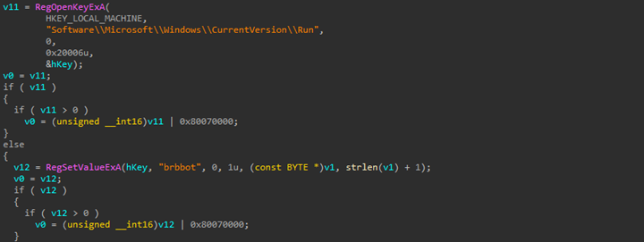
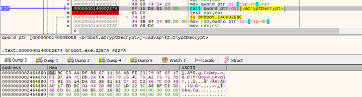
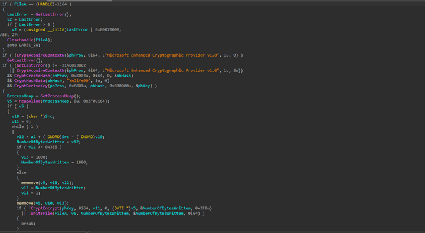

# OverView
The **Brbbot** malware, part of the **Brbbot** malware family. It's a type of **Botnet** malware that lets attackers get into systems without permission. The author can easily enter computers with little or no authentication and then control them by giving commands. Importantly, all the computers affected by this malware follow the same commands from a central control server.

# First Stage :
<br>

## Aritfacts:

|No.	|Description	        |info  |
|-------|-----------------------|------| 
|1	    |MD5 Hash	            |c6a4535a37f6adeac107b22d9d1220ba|
|2	    |SHA256 Hash            |f9227a44ea25a7ee8148e2d0532b14bb640f6dc52cb5b22a9f4fa7fa037417fa|
|3	    |File Size	            |36.00 KB|
|4	    |VirusTotal Detection	|54/71|
<br>


## Identify packed:
The file is packed, and we use the Detect It Easy tool to analyze the malware entropy. Moreover, it's packed using UPX, which is a well-known executable packer.
<!-- first 1 -->


#### We have two ways to unpack the malware. As we can see in the previous figure, the file is packed using UPX.
1. **manual unpacking :**
    
    When loading the malware in IDA and searching for a jump to a register or a specific location, we notice that the start has one function call, so it may be our destination
    <!-- first 2 -->
    
    Digging into this function, and here we go
    <!-- first 3 -->
    

    We will set a breakpoint in the code and use a debugger to analyze the behavior up to the second stage of the malware to see what happens when it jumps to the second stage
    <!-- first 4 -->
    

    We will use x64dbg to dump the second stage (plugins -> OllyDumpEx -> dump process), then correct the virtual offset and find the Entry Point (EIP) as the Original Entry Point (OEP), and finally, save the dumped file
    <!-- first 5 -->
    

    Use Scylla to fix this dump: Go to Plugins → Scylla → IAT Autosearch & Get Imports → Fix Dump → Choose the dumped file from OllydumpEX
    <!-- first 6 -->
    

2. **Automatic unpacking**

    *Trying to unpack it with the UPX tool :*

    The weird error indicates that the malware was packed using UPX, but the tool failed to unpack it.
    <!-- first 7 -->
    

    As a result, the malware author renamed the section to NPX0. To bypass this problem, we should rename the section NPX0 back to UPX0. Let's try this approach: Open the malware in CFF Explorer, go to section headers, modify the name of the section, and then save the changes.
    <!-- first 8 -->
    

    "Let's try again with the UPX tool.
    <!-- first 9    -->
    

    It worked successfully


<br>
<br>
<br>

# Second Stage :

<br>

## Aritfacts:

|No.	|Description	        |info  |
|-------|-----------------------|------| 
|1	    |MD5 Hash	            |8ad88fcaef73e7178209b271ece9611a|
|2	    |SHA256 Hash            |a3b1d477b32b36dc16d500d8ea76e31283fb57033f034d8ac0e9a462ca3d380c|
|3	    |File Size	            |74.00 KB|
|4	    |VirusTotal Detection	|56/71|
<br>


## Basic static :
Open PEstudio to see the strings in the malware

We have interesting strings 
```
exec
Mozilla/4.0 (compatible; MSIE 8.0; Windows NT 6.1; Trident/4.0)
Software\Microsoft\Windows\CurrentVersion\Run
%s?i=%s&c=%s&p=%s
brbconfig.tmp
CONFIG
YnJiYm90
file
conf
exit
sleep
encode
brbbot
HTTP/1.1
Connection: close\r\n
```    
And the important API 

> RegSetValueExA

> RegOpenKeyExA

> RegDeleteValueA
> RegFlushKey

> RegCloseKey

> GetComputerNameA

> GetSystemWow64DirectoryA

> IsDebuggerPresent

> HttpSendRequestA

> InternetReadFile

> InternetConnectA

> InternetOpenA

> HttpOpenRequestA

> InternetSetOptionA

> CreateFileW

> CreateFileA

> WriteFile

> MoveFileExA

> CopyFileA

> DeleteFileA

> CreateProcessA

> GetCurrentProcess

> ExitProcess

> CryptEncrypt

> CryptCreateHash

> CryptDestroyKey

> CryptDecrypt

> CryptDestroyHash

> CryptHashData

> LoadResource

> SizeofResource

> FindResourceA
 
 The malware has a resource, and when you see the content of the resource, it is encrypted
 <!-- Second 1 -->


 Let's jump into dynamic analysis to understand what the malware does with this resource

 ## Basic dynamic :
When viewing logs in Process Monitor, it creates and writes files on our system
 <!-- Second 2 -->


open the file; its content is similar to the resource. Therefore, we can conclude that the malware loads the resource from this file
 <!-- Second 3 -->


  Upon inspecting the Wireshark data, it appears that the malware is sending data to its Command and Control (C2) server located at "brb.3dtuts.by".
 
 <!-- Second 4 -->


<br>
<br>
<br>

Let's delve deeper into the malware and jump into advanced analysis to learn more about it


## Advanced analysis:
Load the malware into IDA.
 Here, it tries to allocate memory, identify its own location in the system, and save this location in the first memory location. Additionally, it seeks to find the (AppData) location in the system and save it in the second memory location. The reasons for performing these actions will be explained later..

 <!-- Second 5 -->


It checks if the malware is present in %AppData% or not; if it's not there, it copies the malware to that location.

 <!-- Second 6 -->


The **brbbot** malware can achieve persistence by creating itself with the following registry keys, and we can see the results in the next figure

 <!-- Second 7 -->


 Load the resource and create a file named 'brbconfig.tmp' to store the content of the resource

 <!-- Second 8 -->


 The malware checks again if the file is created, and if not, it will analyze the error to determine the appropriate action to be taken

 <!-- Second 9 -->


 The malware takes a file handle, retrieves the file size to allocate heap memory with this size, and generates the necessary code to call the API CryptDecrypt. The 5th argument passed to the API is a pointer to the data that will be decrypted (resource data 'brbconfig'). 

 <!-- Second 10 -->


 "Let's jump to the debugger (dbg) to inspect the clear data. 

Before seeing the clear data in the **brbconfig.tmp** I noticed that ``IsDebuggerPresent``
before the main and the start. 

When trying to patch it in debugger it did not call.

So if someone knows  how to bypass this antidebugging technique ,according to MSDN decomentation, the return value from ``IsDebuggerPresent`` should be zero to simulate is not debugging
 
 Set a breakpoint (bp) after the API call and examine the memory location that holds the data. This data is from before calling the API
 <!-- Second 11 -->


 This data is from after calling the API
 <!-- Second 12 -->


*The content :*
```
uri=ads.php;exec=cexe;file=elif;conf=fnoc;exit=tixe;encode=5b;sleep=30000
```
```
uri : The URI for the panel file on the C2 server.
(exec,file,conf,exit) : bot commands.
encode : A single byte key is used to encrypt a list of process names.
sleep : Duration of sleep at a particular juncture.
```

This function serves as a command handler for malware. It interprets commands received from the Command and Control (C2) server, allocating the required heap memory to execute the specified actions. In case the C2 server does not send any command, the malware defaults to connecting with the panel (ads.php)

 <!-- Second 13 -->


 So the whole point is to return the command sent from C2
 <!-- Second 14 -->


 The purpose of this is to obtain information about our system and retrieve the list of currently running processes
 <!-- Second 15 -->


 Concatenate all of that in a buffer allocated on the heap
 <!-- Second 16 -->


 Take the list of processes, convert it to hexadecimal, then perform an XOR operation with 5B (which is the key used in the full command), and finally store the result in a new buffer allocated in the heap.

 <!-- Second 17 -->


Take the IP address (IPV4) and name of the system

 <!-- Second 18 -->


 Here, it resolves C2 server with XOR (#3#or%5452o#8A) with 65 → (brb.3dtuts.by) 

### there is two ways to decode the C2 sever
1. using a python script 
 This is a python script to decode C2 server 
 ```python
 encoded_data = bytes.fromhex('23 33 23 6f 72 25 35 34 35 32 6f 23 38 41')  
xor_key = 0x41  
decoded_data = bytearray()
for byte in encoded_data:
    decoded_byte = byte ^ xor_key
    decoded_data.append(decoded_byte)

print(decoded_data.decode())

 ```
 The Result
 ```
 brb.3dtuts.by
 ```
 1. Putting a breakpoint after the do while loop 
     the encoded data will be cleaned at its place
 <!-- Second 19 -->


 The malware establishes a connection with the C2 (Command and Control) server
 <!-- Second 20 -->


send the list of processes to C2 (encoded data)
 <!-- Second 21 -->


 <!-- Second 22 -->


 Decrypt this data in cyberchef and that what we see
 Here is the list of processes I mentioned earlier.
 <!-- Second 23 -->


br try to read data (command) from C2 and break it down
 <!-- Second 24 -->


  the malware determine whether to create a new process or not
 <!-- Second 25 -->


 <!-- Second 26 -->


malware goes into the 'if' condition based on C2, it will take new actions.

 After that, it will follow three branches, the first one setting an event for the previous action that was created
 <!-- Second 27 -->


 Create a new temporary file in the temporary directory, write data inside it, and then spawn a new process
 <!-- Second 28 -->


Or write data in **brbconfig.tmp** and encrypt it with the same key that was used to decrypt its previous content

 <!-- Second 29 -->


## The Yara Rules

```yara

rule brbbot_malware: brbbot
{
    meta:
       description = "Detect_brbbot _malware"
        author = "@Samaha"
        md5 = "8ad88fcaef73e7178209b271ece9611a"
       sha256 = "a3b1d477b32b36dc16d500d8ea76e31283fb57033f034d8ac0e9a462ca3d380c" 

    strings:
        $s1 = "brbbot"
        $s2 = "brbconfig.tmp"
        $s3 = "%s?i=%s&c=%s&p=%s"
        $s4 = "conf"
        $s5 = "uri"
        $s6 = "exec"

        $get_c2 = {
            80 ?? 41                       //  xor     byte ptr [rax], 41h
            48 ?? ??                       //  inc     rax
            48 ?? ??                       //  dec     rdi
            75 ??                          //  jnz     short loc_140001EA0
            48 ?? ??                       //  mov     rcx, rsi        ; lpszServerName
        }

    condition:
        uint16(0) == 0x5A4D and all of them 
}

```


