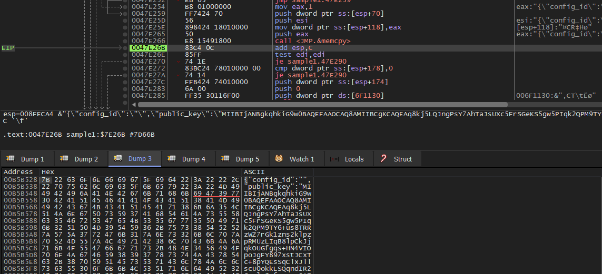
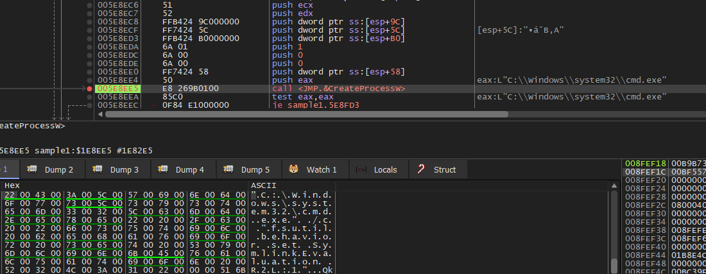
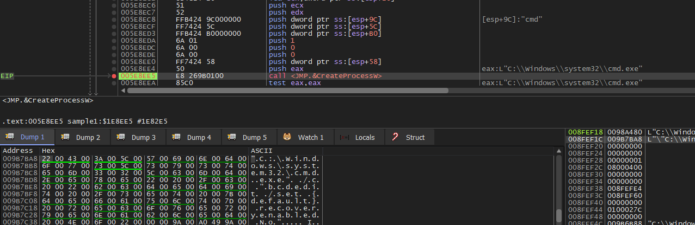
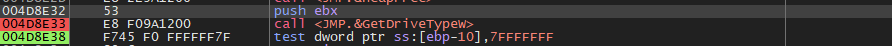
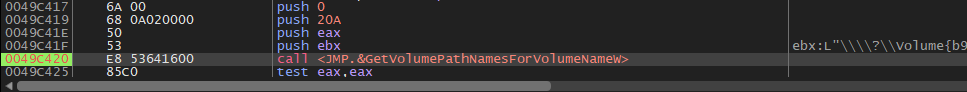
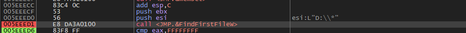

# OverView
***BlackCat*** is the first ransomware made in Rust that's widely known. It needs some parameters to work, and the access token in some variants needs to be 32 bytes, but in mine, it takes any dummy access token to work. Plus, you can set other options. It comes with cleared or encrypted configuration that tell it which services to stop, what files to leave alone, and it saves stolen passwords. It also wipes out all backups, boosts its privileges, and lets it make tricky links on the victim's computer.

# Aritfacts:
|No.	|Description	        |info  |
|-------|-----------------------|------| 
|1	    |MD5 Hash	            |ff8a7dd8b1cb0420dd18810041d172a7|
|2	    |SHA256 Hash            |ecea6b772742758a2240898ef772ca11aa9d870aec711cffab8994c23044117c|
|3	    |File Size	            |2940 KB|
|4	    |VirusTotal Detection	|52/71|
<br>

# Analysis
When the malware is run without its parameters, it doesn't perform any actions on our system. Therefore, the malware can operate using any of the following parameters :


The ``AddVectoredExceptionHandle`` API is used to establish a vectored exception handler .


The malware retrieves the command line using the ``GetCommandLineW`` API .


Here , try reallocating heap memory for the configuration .


Now the malware writes the configuration into memory .



### Configuration :

#### Content :

```
{"config_id":"","public_key":"MIIBIjANBgkqhkiG9w0BAQEFAAOCAQ8AMIIBCgKCAQEAq8kj5LQJngPsY7AhTaJsUXc5FrSGeKS5gw5PIqk2QPM9TY6+us8TRRzWZ7rGk1zns2klpzpRMUzLIqB8lpCkJjqkOUGfgqs+HN4VIOpoJgFY897xstJCxTc+8pYQEsSqClxJllscU0okkLSQqndIR2Gznlg3qfcwyncJAFBInyqM+L4kbwCQZ6x5HNiLe2lJn8RP2aDiMI+RS1uLYron2G7rxDTUQnxThMtgLAeko8ulaB3TpB0g4lmHCenkEZeBNs81986+MjHnv7KkiscZ7ZrezKjNaIxRs8BAcD9y+Q9QQxCvZMS01ITNXcgiItbA4dsGq1fPJ42yBkkiIodsEQIDAQAB","extension":"kh1ftzx","note_file_name":"RECOVER-${EXTENSION}-FILES.txt","note_full_text":">> What happened?\n\nImportant files on your network was ENCRYPTED and now they have \"${EXTENSION}\" extension.\nIn order to recover your files you need to follow instructions below.\n\n>> Sensitive Data\n\nSensitive data on your system was DOWNLOADED.\nIf you DON'T WANT your sensitive data to be PUBLISHED you have to act quickly.\n\nData includes:\n- Employees personal data, CVs, DL, SSN.\n- Complete network map including credentials for local and remote services.\n- Private financial information including: clients data, bills, budgets, annual reports, bank statements.\n- Manufacturing documents including: datagrams, schemas, drawings in solidworks format\n- And more...\n\n>> CAUTION\n\nDO NOT MODIFY ENCRYPTED FILES YOURSELF.\nDO NOT USE THIRD PARTY SOFTWARE TO RESTORE YOUR DATA.\nYOU MAY DAMAGE YOUR FILES, IT WILL RESULT IN PERMANENT DATA LOSS.\n\n>> What should I do next?\n\nFollow these simple steps to get everything back to normal:\n1) Download and install Tor Browser from: hxxps://torproject[.]org/\n2) Navigate to: hxxp://rfosusl6qdm4zhoqbqnjxaloprld2qz35u77h4aap46rhwkouejsooqd[.]onion/?access-key=${ACCESS_KEY}","note_short_text":"Important files on your network was DOWNLOADED and ENCRYPTED.\nSee \"${NOTE_FILE_NAME}\" file to get further instructions.","default_file_mode":"Auto","default_file_cipher":"Best","credentials":[],"kill_services":["mepocs","memtas","veeam","svc$","backup","sql","vss","msexchange","sql$","mysql","mysql$","sophos","MSExchange","MSExchange$","WSBExchange","PDVFSService","BackupExecVSSProvider","BackupExecAgentAccelerator","BackupExecAgentBrowser","BackupExecDiveciMediaService","BackupExecJobEngine","BackupExecManagementService","BackupExecRPCService","GxBlr","GxVss","GxClMgrS","GxCVD","GxCIMgr","GXMMM","GxVssHWProv","GxFWD","SAPService","SAP","SAP$","SAPD$","SAPHostControl","SAPHostExec","QBCFMonitorService","QBDBMgrN","QBIDPService","AcronisAgent","VeeamNFSSvc","VeeamDeploymentService","VeeamTransportSvc","MVArmor","MVarmor64","VSNAPVSS","AcrSch2Svc"],"kill_processes":["agntsvc","dbeng50","dbsnmp","encsvc","excel","firefox","infopath","isqlplussvc","msaccess","mspub","mydesktopqos","mydesktopservice","notepad","ocautoupds","ocomm","ocssd","onenote","oracle","outlook","powerpnt","sqbcoreservice","sql","steam","synctime","tbirdconfig","thebat","thunderbird","visio","winword","wordpad","xfssvccon","*sql*","bedbh","vxmon","benetns","bengien","pvlsvr","beserver","raw_agent_svc","vsnapvss","CagService","QBIDPService","QBDBMgrN","QBCFMonitorService","SAP","TeamViewer_Service","TeamViewer","tv_w32","tv_x64","CVMountd","cvd","cvfwd","CVODS","saphostexec","saposcol","sapstartsrv","avagent","avscc","DellSystemDetect","EnterpriseClient","VeeamNFSSvc","VeeamTransportSvc","VeeamDeploymentSvc"],"exclude_directory_names":["system volume information","intel","$windows.~ws","application data","$recycle.bin","mozilla","$windows.~bt","public","msocache","windows","default","all users","tor browser","programdata","boot","config.msi","google","perflogs","appdata","windows.old"],"exclude_file_names":["desktop.ini","autorun.inf","ntldr","bootsect.bak","thumbs.db","boot.ini","ntuser.dat","iconcache.db","bootfont.bin","ntuser.ini","ntuser.dat.log"],"exclude_file_extensions":["themepack","nls","diagpkg","msi","lnk","exe","cab","scr","bat","drv","rtp","msp","prf","msc","ico","key","ocx","diagcab","diagcfg","pdb","wpx","hlp","icns","rom","dll","msstyles","mod","ps1","ics","hta","bin","cmd","ani","386","lock","cur","idx","sys","com","deskthemepack","shs","ldf","theme","mpa","nomedia","spl","cpl","adv","icl","msu"],"exclude_file_path_wildcard":[],"enable_network_discovery":true,"enable_self_propagation":true,"enable_set_wallpaper":true,"enable_esxi_vm_kill":true,"enable_esxi_vm_snapshot_kill":true,"strict_include_paths":[],"esxi_vm_kill_exclude":[]} 
```

Let's break it down to know what this Configuration :

1. ``config_id`` : Configuration ID, empty up until now 

2. ``public_key`` : encryption Public Key (Base64 encoded)

3. ``extension`` : 	Extension for encrypted files

4. ``note_file_name`` : Filename of the Ransomnote

5. ``note_full_text`` : Long version of the Ransomnote

6. ``note_short_text`` : Short version of the Ransomnote

7. ``default_file_mode`` : File Encryption Mode (observed: "auto")

8. ``default_file_cipher`` : File Encryption Cipher (observed: "Best")

9. ``credentials`` : Array of compromised credentials for escalation and propagation

10. ``kill_services`` : 	List of services to be terminated

11. ``kill_processes`` : 	List of processes to be terminated

12. ``exclude_directory_names`` : Directories that are excluded from the encryption process

13. ``exclude_file_names`` : Files that are excluded from the encryption process

14. ``exclude_file_extensions`` : File extensions that are excluded from the encryption process 

15. ``exclude_file_path_wildcard`` : Filepaths to be excluded via wildcard 

16. ``enable_network_discovery`` : Switch to enable/disable network discovery	

17. ``enable_self_propagatio``n : Switch to enable/disable self propagation

18. ``enable_set_wallpaper`` : Switch to enable/disable wallpaper change	

19. ``enable_esxi_vm_kill`` : Switch to enable/disable VM termination on ESXi Hosts	

20. ``enable_esxi_vm_snapshot_kill`` : Switch to enable/disable Snapshot deletion on ESXi Hosts	

21. ``strict_include_paths`` : Hardcoded filepaths 

22. ``esxi_vm_kill_exclude`` : Exclusion list for virtual machines on ESXi Hosts

<br>


The malware attempts to open a handle for ``SOFTWARE\Microsoft\Cryptography`` .


Blackcat tries to extract the ``MachineGUID`` .


Calling ``BCryptGenRandom`` to generate random bytes .


This snippet of code shows the malware attempting to open a handle for ``CMD`` if it is in the same directory as the malware  .


When it fails , it tries to open it in ``System32`` .


The malware attempts to open a handle for the null device. We will investigate this null device further .


Now try to determine the ``ID`` for itself .


The malware generates 16 random bytes by calling ``BCryptGenRandom`` again .


Then it creates a named pipe with the ``process ID`` and random number returned from ``BCryptGenRandom`` to receive the output of the executed command .


Open a handle for the same named pipe and store this handle in the **STARTUPINFO** structure to redirect the output for the ``CMD`` process to the named pipe .


Create a process for ``CMD`` with the command ``/c wmic csproduct get UUID`` , and the output for this will be stored in the named pipe .


Now attempt to read the output from the named pipe using the ``ReadFile`` API , passing the handle for the pipe to the API .


Getting information about the system by calling ``GetSystemInfo`` .


The malware checks for privileges using ``SHTestTokenMembership`` .


Here , the access token for the process is opened with ``NtOpenProcessToken`` .


According to MSDN , ``NtQueryInformationToken`` retrieves a **TOKEN_GROUPS** structure .


The malware sets up the COM library for operation using ``CoInitializeEx`` . It utilizes a ``COM`` object identified by the ``CLSID:{3E5FC7F9-9A51-4367-9063-A120244FBEC7}`` , which corresponds to the auto-elevated ``CMSTPLUA`` interface . This interface facilitates the initiation of a new process with arguments , with elevated permissions .


The executable is launched with administrative privileges .


Here , retrieve the ``LUID`` for privileges .


The list of privileges is as follows :

```````
SeIncreaseQuotaPrivilege 
SeSecurityPrivilege 
SeTakeOwnershipPrivilege
SeLoadDriverPrivilege 
SeSystemProfilePrivilege 
SeSystemtimePrivilege
SeProfileSingleProcessPrivilege 
SeIncreaseBasePriorityPrivilege
SeCreatePagefilePrivilege
SeBackupPrivilege 
SeRestorePrivilege
SeShutdownPrivilege 
SeDebugPrivilege 
SeSystemEnvironmentPrivilege
SeChangeNotifyPrivilege 
SeRemoteShutdownPrivilege 
SeUndockPrivilege
SeManageVolumePrivilege 
SeImpersonatePrivilege 
SeCreateGlobalPrivilege
SeIncreaseWorkingSetPrivilege 
SeTimeZonePrivilege
SeCreateSymbolicLinkPrivilege 
SeDelegateSessionUserImpersonatePrivilege
```````

Using ``AdjustTokenPrivileges`` , all the mentioned privileges are activated within the access token .


Using the ``CreateProcessW`` API, a process is initiated for CMD with the commands ``/c fsutil behavior set SymlinkEvaluation R2L:1`` and ``/c fsutil behavior set SymlinkEvaluation R2R:1`` . This command enables the usage of both remote and local symlinks, activating the *remote to local* and *remote to remote* functionalities .




BlackCat attempts to stop ``IISReset.exe`` by creating a ``CMD`` process with ``/c iisreset.exe /stop``.


Here, create a ``CMD`` process with ``/c reg add HKEY_LOCAL_MACHINE\SYSTEM\CurrentControlSet\Services\LanmanServer\Parameters /v MaxMpxCt`` . This modification likely adjusts a parameter related to the LanmanServer service, specifically setting the maximum number of simultaneous network requests. 


The output from the previous command would typically be the confirmation message indicating that the registry key value has been successfully modified .


The malware executes ``CMD`` with the command ``arp -a`` to retrieve the ARP table .


Creating a ``CMD`` process with ``/c vssadmin.exe Delete Shadows /all /quiet`` to delete all Volume Shadow Copies by utilizing the ``vssadmin.exe``utility .


This is another way to delete all Volume Shadow Copies by creating a ``CMD`` process with ``/c wmic.exe Shadowcopy Delete`` .


I don't know why, but the malware creates a ``CMD`` process with ``/c bcdedit /set {default}`` that is incomplete .


The return from the previous incomplete command is an error .


This command , ``/c bcdedit /set {default} recoveryenabled No`` , effectively disables recovery options for the default boot entry in the Windows boot loader .




The command ``/c for /F "tokens=*"" %1 in ('wevtutil.exe el') DO wevtutil.exe cl %1`` passed to ``CMD`` will correctly clear all event logs .


The malware wants to know the computer name by calling ``GetComputerNameW`` .


Malware opens the Service Control Manager by calling ``OpenSCManagerW`` with ``SC_MANAGER_ALL_ACCESS`` .


Try to get a list of services by using ``EnumServicesStatusExW`` .


The malware kills the targeted service with ``ControlService`` .


The malware gets a list of all running processes in the system with ``CreateToolhelp32Snapshot`` .


The enumeration of processes is performed through the utilization of the ``Process32FirstW`` and ``Process32NextW`` APIs .


Killing the target process by calling ``TerminateProcess`` .


Here , call ``GetDriveTypeW`` to determine the type of drive .




The malware retrieves volumes in the system using ``FindFirstVolumeW`` .


Using ``VolumePathNamesForVolumeNameW`` takes the volume name as input and returns a list of volume GUID paths .



Here , continue enumerating using ``FindNextVolumeW`` .


Calling ``SetVolumeMountPointW`` links a volume with either a drive letter or a directory located on another volume . 


BlackCat calls ``GetLogicalDrives`` to return the currently available disk drives .


The malware scans the file system using the ``FindFirstFileW`` and ``FindNextFileW`` APIs .




Here , the malware wants to retrieve some information about files using ``GetFileInformationByHandle`` .


Malware uses ``MoveFileExW`` to change the file extension .


Calling ``SetFilePointerEx`` with ``FILE_END`` and ``FILE_BEGIN`` to set the pointer to the target position that needs to be encrypted .


Then using ``ReadFile`` to read 4 bytes that are to be encrypted .


After that , it calls ``WriteFile`` to write the ransom note .


In the process memory, a JSON structure is assembled, comprising details such as the encryption cipher (AES), the AES key utilized for file encryption, the data itself, and the size of each data chunk .


The file content is encrypted using the AES-128 algorithm, employing the aesenc instruction for this purpose .


```
BlackCat encrypts data by employing a randomly generated AES Key, which is then encrypted and stored using the public key within configurations embedded in each encrypted file.
```

### Encryption way 
```
After that, BlackCat acquires handles for files and encrypts them, verifying whether they are not excluded . 

It retrieves the content, encrypts it, and then transfers the encrypted content back to its respective file . 

Following this, it changes the file extension according to the configurations and deposits the ransom note in every folder across the system .
```

## IOCs :
1. **Pipe** : ``\\.\pipe\__rust_anonymous_pipe1__.[Process ID].[Random number]``

2. **Processes spawned** :
```
cmd.exe /c “wmic csproduct get UUID”

cmd.exe /c “fsutil behavior set SymlinkEvaluation R2L:1”

cmd.exe /c “fsutil behavior set SymlinkEvaluation R2R:1”

cmd.exe/c “reg add HKEY_LOCAL_MACHINE\SYSTEM\CurrentControlSet\Services\LanmanServer\Parameters
/v MaxMpxCt /d 65535 /t REG_DWORD /f”

cmd.exe /c “arp -a”

cmd.exe /c “iisreset.exe /stop”

cmd.exe /c “vssadmin.exe Delete Shadows /all /quiet”

cmd.exe /c “wmic.exe Shadowcopy Delete”

cmd.exe /c “bcdedit /set {default}”

cmd.exe /c “bcdedit /set {default} recoveryenabled No

cmd.exe /c for /F “tokens=*” %1 in (‘wevtutil.exe el’) DO wevtutil.exe cl %1
```

3. **Ransom Note** : ``RECOVER-${kh1ftzx}-FILES.txt``

4. **Files** : ``RECOVER-kh1ftzx-FILES.txt.png``


## Configuration Extractor

```python
import sys
import pefile
import binascii

def extract_rdata(filename):
    pe = pefile.PE(filename)
    for section in pe.sections:
        if b'.rdata' in section.Name:
            rdata_start = section.PointerToRawData
            rdata_size = section.SizeOfRawData
            with open(filename, 'rb') as f:
                f.seek(rdata_start)
                return f.read(rdata_size)

def main():
    if len(sys.argv) != 2:
        print("Usage: python script.py filename")
        sys.exit(1)
    
    filename = sys.argv[1]
    try:
        rdata_content = extract_rdata(filename)
        if rdata_content:
            data = rdata_content
            print("Data extracted from .rdata section:")
            print(rdata_content[0x1716C:0x18256].decode('utf-8', errors='ignore'))  
        else:
            print("No .rdata section found in the file.")
    except Exception as e:
        print(f"Error: {e}")

if __name__ == "__main__":
    main()
```

## The Yara Rules

```yara
rule blackcat: Ransomware
{
    meta:
       description = "Detect blackcat rasomware"
        author = "@Samaha"
        md5 = "ff8a7dd8b1cb0420dd18810041d172a7"
       sha256 = "ecea6b772742758a2240898ef772ca11aa9d870aec711cffab8994c23044117c" 

    strings:
        $s1 = "RECOVER-${EXTENSION}-FILES.txt"
        $s2 = "\\.\\pipe\\__rust_anonymous_pipe1__."
        $s3 = "esxi_vm_kill_exclude"
        $s4 = "enable_network_discovery"
        $s5 = "enable_esxi_vm_kill"
        $s6 = "exclude_file_path_wildcard"
        $s7 = "enable_self_propagation"
    condition:
        uint16(0) == 0x5A4D and (6 of ($s*)) 
}
```


